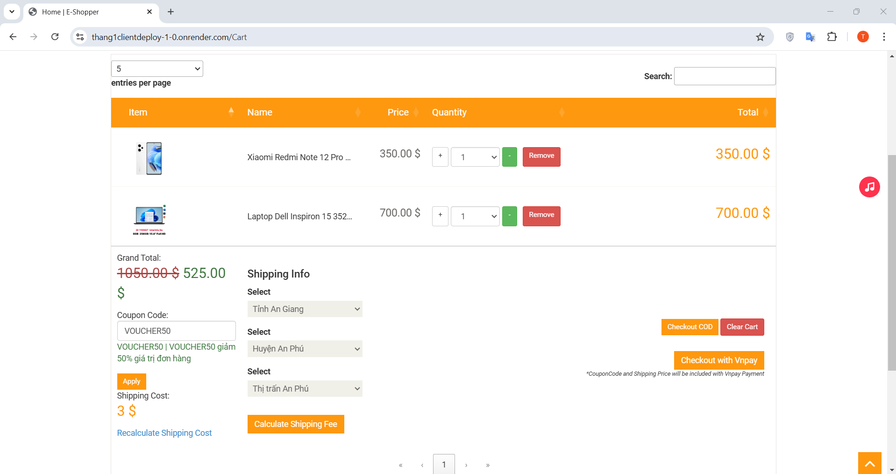

# Mock Project Electronic Devices Store

**Topic**: Electronic devices store website

**Technologies used**:

- Client: ASP.Net Core MVC, Boostrap, HttpClient, SignalR
- API: ASP.Net Core Web API, SQLite, EntityFramework Core, Redis
- Identity Provider Server: Duende Identity, SQLite, EntityFramework Core, Federation Facebook login
- Unit Test: XUnit, Moq package, InMemoryDB EFCore
- For local projects, you can change to any type of db you want. EX: SQLite, MS SQL Server, PostgreSQL,...
- For deployment hosting (in the deployment branch), I changed SQLite to Postgres SQL, Redis cloud for caching, Cloudinary for hosting image and use Docker, Render.com for deploying.

## Description

- This is the Electronic devices store website where customers can find and buy electronic products they want online via the internet.
- We have 2 roles in the system: Admin and User<br/>
    Admin: they can manage the product, order, user, coupon, slider, statistic, etc in the system by using the admin page.<br/>
    User: they can search, find products, place orders, checkout(COD, Vnpay), view order history, update infor, forget pass, listen to music and so on.
- Demo account (for both local project and hosting website) <br/>
  Admin: admin - pwd: 123456 <br/>
  User: user1 - pwd: 123456 <br/>
- For deployment, I have only used a free service so it will take a bit to load both FE, API and IDP server<br />
IDP: https://thang1idpddeploy-1-0.onrender.com/.well-known/openid-configuration<br />
API: https://thang1apideploy-1-0.onrender.com/swagger/index.html <br />
Client: https://thang1clientdeploy-1-0.onrender.com/
- Some pages from the website<br/>
    
    
    
  

## SETUP (Local project)
- Clone the project.
- Add all appsettings.json files for 3 projects:
- appsettings.json(Identity Project)
```
# Your Sqlite and frontend port URL 
  "ConnectionStrings": {
    "ThangIdentityDBConnectionString": "Data Source=ThangIdentity.db;foreign keys=true"
  },
  "FEPort": "https://localhost:7226",
  "FacebookAppId": "",
  "FacebookAppSecret": ""
```
- appsettings.json(API Project)
```
# Your BE, IDP Database, Url and Redis
  "ConnectionStrings": {
    "ShoppingStoreDBConnectionString": "Data Source=ShoppingStore.db",
    "IdentityDBConnectionString": "DataSource=..\\Thang.IDP\\ThangIdentity.db"
  },
  "IDPServerRoot": "https://localhost:5001/",
  "ClientRoot": "https://localhost:7226",
  "RedisConfiguration": {
    "Enabled": true,
    "ConnectionString": "127.0.0.1"
  }
```
- appsettings.json(Client FE Project)
```
# Your URL path, Vnpay infor
  "ShoppingStoreAPIRoot": "https://localhost:7045/",
  "IDPServerRoot": "https://localhost:5001/",
  "ShoppingStoreAPIImagePathBase": "https://localhost:7045/media/",
  "ShoppingStoreAPIImagePath": "https://localhost:7045/media/products/",
  "ShoppingStoreAPISliderPath": "https://localhost:7045/media/sliders/",
  "ShoppingStoreAPILogoPath": "https://localhost:7045/media/logo/",
  "Vnpay": {
    "TmnCode": "",
    "HashSecret": "",
    "BaseUrl": "https://sandbox.vnpayment.vn/paymentv2/vpcpay.html",
    "Command": "pay",
    "CurrCode": "VND",
    "Version": "2.1.0",
    "Locale": "vn",
    "PaymentBackReturnUrl": "https://localhost:7226/Checkout/PaymentCallbackVnpay"
  },
  "TimeZoneId": "SE Asia Standard Time" // GMT+7. If do not us Windows OS change it to: Asia/Bangkok
```
- Add migration and update Database for BE,IDP. (If any changes)
- Setup to run 3 projects simultaneously.
